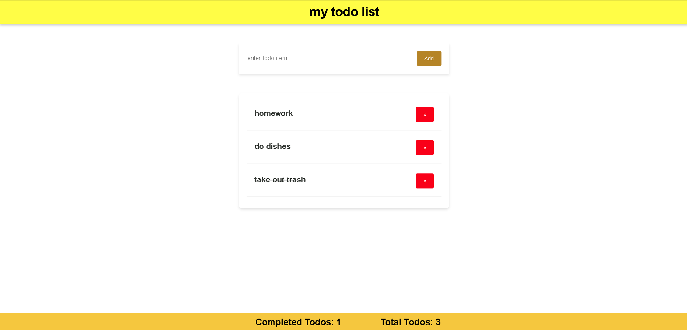

# Todo List App

This application is a straightforward Todo List, constructed with React and Vite. The development of this project was primarily guided by the instructions provided in the "React For Beginners" course by Code Stoic.

## Application Preview


## Features

- **Task Addition**: Users can add tasks to the list. Each task should have a unique name to ensure smooth operation.
- **Task Completion**: By clicking on the task text, users can mark tasks as completed. Completed tasks are visually distinguished by a strikethrough and are listed at the bottom of the list.
- **Task Deletion**: Tasks can be removed from the list by clicking the delete button.
- **Task Count**: The application displays the total number of tasks and the number of completed tasks.

## Installation

To set up this project on your local machine, follow these steps:

1. Clone the repository:
    ```bash
    git clone https://github.com/Tariq-Sekhri/todo-app.git
    ```

2. Navigate into the project directory:
    ```bash
    cd todolist-app
    ```

3. Install the dependencies:
    ```bash
    npm install
    ```

4. Start the development server:
    ```bash
    npm run dev
    ```

Now, you can open your browser and visit `http://localhost:5173` to view the app.

## Technologies Used

- React
- Vite

## Contributing

Contributions are welcome! Please feel free to submit a Pull Request.
